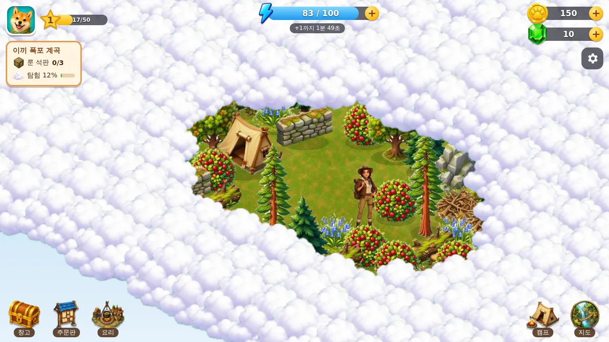

# 🧭 다람 탐험대 (에너지 탐험 게임)

에너지를 써서 **구름에 덮인 땅을 개척하는** 아이소메트릭 탐험 게임임.
나무·바위·덤불을 치우면 자원을 얻고, 치운 자리 주변의 구름이 걷히며 새 길이 열림.
외부 라이브러리·CDN 없이 `index.html` 한 파일 + `img/` 그림 폴더로 동작함.



## ▶️ 실행 방법
- **가장 쉬운 방법**: `explore` 폴더를 통째로 정적 호스팅(Cloudflare Pages, GitHub Pages 등)에 올리고 주소로 접속함.
- **내 컴퓨터에서**: `explore` 폴더에서 아래 명령 실행 → 브라우저에서 `http://localhost:8000` 접속.
  ```
  python -m http.server 8000
  ```
  (`index.html` 더블클릭으로도 열리지만, 일부 브라우저는 로컬 파일 그림을 막을 수 있어 서버 실행을 권장함)
- 성공 확인: 로딩 막대가 찬 뒤 **환영 창**이 뜨고, "첫 탐험 떠나기"를 누르면 구름 속 섬과 탐험가가 보이면 성공임.

## 🎮 게임 구성
| 요소 | 내용 |
|------|------|
| 에너지 | 장애물마다 필요한 에너지(⚡1~10)가 다름. 기본 2분에 1씩 충전, 레벨업 시 가득 참 |
| 탐험 | 길과 맞닿은 장애물만 치울 수 있음. 여러 개를 연달아 누르면 번호 순서대로 작업함 |
| 구름(안개) | 치운 자리 반경 2칸의 구름이 걷힘 |
| 목표 | 지역마다 숨은 **룬 석판 3개** 찾기 → 보석·코인 보상, 새 모습으로 다시 탐험 가능 |
| 보물 상자 | 코인, 보석, 에너지 중 무작위 |
| 캠프 | 통나무집·부엌·주문판·텐트 + 제재소(Lv2에 건설)·대장간(Lv4에 건설) |
| 생산 타이머 | 부엌(베리 죽 2분·버섯 수프 4분·베리 파이 5분·코코넛 푸딩 6분), 제재소(판자 1분), 대장간(철 주괴 3분). 한 줄로 차례차례 만들어지고, 다 되면 건물 위에 표시가 뜸 |
| 건물 업그레이드 | 최대 Lv5. 판자·철 주괴·돌·코인 필요. Lv(n→n+1)에는 탐험가 레벨 2n 필요 |
| 업그레이드 효과 | 통나무집: 최대 에너지 +10/단계 · 부엌·제재소·대장간: 작업 칸 증가, 시간 -10%/단계 · 텐트: 낮잠 에너지 +10, 대기 -10% · 주문판: 주문 수 증가, 코인 +15% |
| 1장 지역 | 이끼 폭포 계곡(Lv1) · 거인 나무 둥지(Lv3) · 라벤더 풍차 언덕(Lv5) · 서리 얼음 고개(Lv8) |
| 2장 지역 | 산호 해변 만(Lv10) · 반딧불 버섯 늪(Lv12) · 붉은 모래 협곡(Lv14) · 잠든 화산 기슭(Lv17). 지도 오른쪽 ▶로 넘김 |
| 장애물 | 1장 14종 + 2장 11종(야자수·떠밀려 온 나무·조개 무더기·사암 바위·거대 버섯·늪 갈대·선인장·금맥 바위·흑요석 바위·불탄 나무·불꽃 수정) |
| 조작 | 끌기: 화면 이동 · 휠/두 손가락: 확대·축소 · 탭: 치우기/걷기 |

## ⚙️ 설정값 (하드코딩하지 않음)
- 게임 안 **톱니바퀴** 창에서 에너지 충전 시간, 최대 에너지, 낮잠 보상·대기 시간, **요리·제작 시간 배율**을 바꿀 수 있음.
- 제조법은 `PROD`, 건물 비용·효과는 `BUILDINGS`, 2장 개방 레벨은 `CONFIG.chapter2Level`에 모여 있음.
- 기본값은 `index.html` 맨 위 `CONFIG` 블록에 모여 있음.

## 🔒 개인정보
- 진행 상황은 **그 기기 브라우저(localStorage)에만** 저장됨. 서버 전송 없음.
- 이름·사진·연락처 등 개인정보를 받지 않음.

## 🎨 그림
- 모든 그림은 **Canva AI 이미지 생성**으로 제작함(원작 게임의 그림·캐릭터·이름은 사용하지 않은 창작 에셋).
- `raw/` = Canva 생성 원본(73장), `img/` = 배경 제거·WebP 변환본.
- 다시 변환하려면: `pip install pillow numpy` 후 `explore` 폴더에서 `python tools/cutout.py raw img`.
- `tools/canva-assets.json` = 그림별 Canva 미디어 ID. `https://www.canva.com/M/<ID>`로 원본을 찾을 수 있음.
- 참고: 제작 환경의 네트워크 정책상 Canva 원본 해상도 파일을 받을 수 없어 **미리보기 해상도(약 200px)를 2배 확대**해 사용함.
  Canva에서 원본을 내려받아 `raw/`에 같은 이름으로 넣고 다시 변환하면 더 선명해짐.
