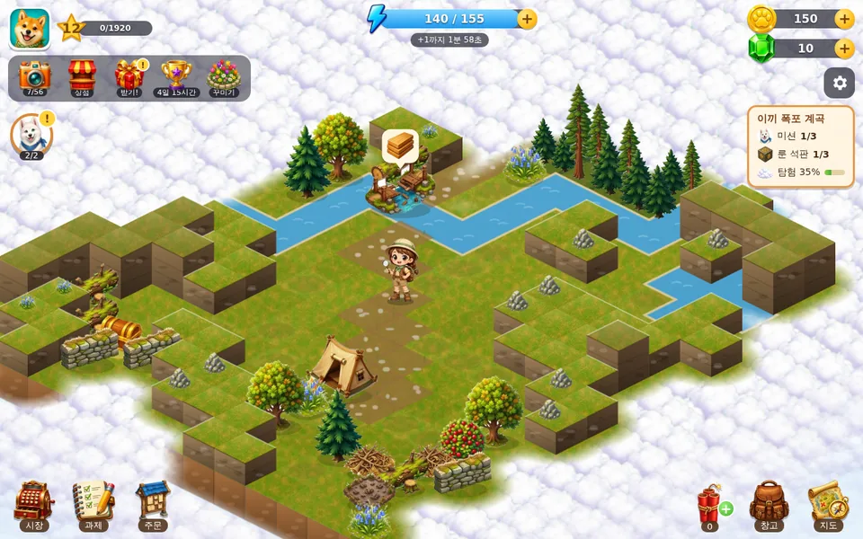

# 🧭 다람 탐험대 (에너지 탐험 게임)

에너지를 써서 **구름에 덮인 땅을 개척하는** 아이소메트릭 탐험 게임임.
나무·바위·덤불을 치우면 자원을 얻고, 치운 자리 주변의 구름이 걷히며 새 길이 열림.
외부 라이브러리·CDN 없이 `index.html` 한 파일 + `img/` 그림 폴더로 동작함.



## ▶️ 실행 방법
- **Cloudflare에 올리기(권장)**: `explore-cloudflare.zip` 안의 `1-읽어보세요.txt` 참고.
  `explore-worker.js`(워커 붙여넣기용)와 `dist/index.html`(Pages용)은 **그림 151장이 파일 안에 들어간 한 파일짜리**라 `img` 폴더가 필요 없음.
  화면이나 그림을 고친 뒤에는 `node build-explore.mjs`로 다시 만듦.
- **가장 쉬운 방법**: `explore` 폴더를 통째로 정적 호스팅(Cloudflare Pages, GitHub Pages 등)에 올리고 주소로 접속함.
- **내 컴퓨터에서**: `explore` 폴더에서 아래 명령 실행 → 브라우저에서 `http://localhost:8000` 접속.
  ```
  python -m http.server 8000
  ```
  (`index.html` 더블클릭으로도 열리지만, 일부 브라우저는 로컬 파일 그림을 막을 수 있어 서버 실행을 권장함)
- 성공 확인: 로딩 막대가 찬 뒤 **환영 창**이 뜨고, "첫 탐험 떠나기"를 누르면 구름 속 섬과 탐험가가 보이면 성공임.

## 🎮 게임 구성
| 요소 | 내용 |
|------|------|
| 에너지 | 장애물마다 필요한 에너지(⚡1~10)가 다름. 기본 2분에 1씩 충전, 레벨업 시 가득 참 |
| 탐험 | 길과 맞닿은 장애물만 치울 수 있음. 여러 개를 연달아 누르면 번호 순서대로 작업함 |
| 구름(안개) | 치운 자리 반경 2칸의 구름이 걷힘 |
| 목표 | 지역마다 숨은 **룬 석판 3개** 찾기 → 보석·코인 보상, 새 모습으로 다시 탐험 가능 |
| 보물 상자 | 코인, 보석, 에너지 중 무작위 |
| 캠프 | 통나무집·부엌·주문판·텐트 + 제재소(Lv2에 건설)·대장간(Lv4에 건설) |
| 농장 | 밭 6곳(처음 2곳, 나머지는 레벨·코인으로 개간). 밀(2분)·옥수수(5분, Lv3) 심기 → 다 자라면 눌러서 수확 |
| 동물 | 닭장(Lv2, 밀 → 달걀 3분)·외양간(Lv4, 옥수수 → 우유 5분). 동물마다 동시에 생산, 다 차면 건물 위에 **MAX** 표시 |
| 생산 화면 | 원작과 같은 구성: 건물을 비추고 위에 제목·◀▶(건물 넘기기)·작업 칸, 💎 즉시 완성, 아래에 재료 카드·제품 카드·제품 고르기 |
| 새 생산 건물 | 빵집(Lv3: 밀가루·빵·쿠키), 치즈 공방(Lv5: 치즈), 벽돌 가마(Lv6: 벽돌), 도자기 공방(Lv7: 항아리), 대장간에 다이너마이트 추가 |
| 다이너마이트 | 지역 곳곳의 **거대한 바위**는 다이너마이트가 있어야 부술 수 있음(오른쪽 아래 버튼에서 보석으로 사거나 대장간에서 제작) |
| 시장(계산대) | 남는 물건을 코인으로 팔기 |
| 과제 수첩 | 장애물 치우기·수확·제작·주문·판매 과제 3개, 끝내면 코인·경험치·보석·다이너마이트 |
| 흙길 | 지역마다 출발 텐트 → 수리 지점 → 룬 석판 쪽으로 이어지는 흙길. 길 위는 대부분 비어 있어 따라가며 구름을 걷어 냄 |
| 이야기 미션 | 지역마다 미션 3단계(등장인물 대화 + 목표 2개). 목표: 장애물 치우기·자원 모으기·수리 지점 고치기·룬 석판 찾기 |
| 수리 지점 | 무너진 다리·막힌 우물·부서진 울타리. 눌러서 재료 카드(보기 버튼) 확인 → 재료가 다 모이면 **확인!** |
| 🔍 돋보기·보기 | 목표가 있는 곳으로 화면을 옮기고 노란 화살표로 표시(만드는 물건은 해당 생산 건물 안내) |
| 지역 완료 | 미션 3단계를 끝내면 지도 메달에 초록 ✓ |
| 이벤트 줄 | 도감(모은 물건 수), 에너지 상점, 일일 선물(20시간마다) |
| 생산 타이머 | 부엌·제재소·대장간·빵집 등은 한 줄로 차례차례 만들어짐(작업 칸 Lv1 3칸 ~ Lv5 7칸). 다 되면 건물 위에 말풍선 |
| 건물 업그레이드 | 최대 Lv5. 판자·철 주괴·돌·코인 필요. Lv(n→n+1)에는 탐험가 레벨 2n 필요 |
| 업그레이드 효과 | 통나무집: 최대 에너지 +10/단계 · 부엌·제재소·대장간: 작업 칸 증가, 시간 -10%/단계 · 텐트: 낮잠 에너지 +10, 대기 -10% · 주문판: 주문 수 증가, 코인 +15% |
| 1장 지역 | 이끼 폭포 계곡(Lv1) · 거인 나무 둥지(Lv3) · 라벤더 풍차 언덕(Lv5) · 서리 얼음 고개(Lv8) |
| 2장 지역 | 산호 해변 만(Lv10) · 반딧불 버섯 늪(Lv12) · 붉은 모래 협곡(Lv14) · 잠든 화산 기슭(Lv17). 지도 오른쪽 ▶로 넘김 |
| 장애물 | 1장 14종 + 2장 11종(야자수·떠밀려 온 나무·조개 무더기·사암 바위·거대 버섯·늪 갈대·선인장·금맥 바위·흑요석 바위·불탄 나무·불꽃 수정) |
| 3장 지역 | 대나무 물빛 숲(Lv20) · 푸른 수정 동굴(Lv22) · 잃어버린 정글 유적(Lv24) · 황금 단풍 산(Lv27). 개방 레벨은 `CONFIG.chapter3Level` |
| 3장 장애물·자원 | 대나무 덤불·벚나무·푸른 수정 무더기·종유석·정글 덩굴 나무·무너진 유적 기둥·단풍나무·호박 덩굴 → 대나무·푸른 수정·덩굴·호박·단풍 시럽. 부엌에 호박 파이 추가 |
| 고정 지도 | 모든 지역 지도를 직접 설계함(강·다리·우물·흙길·룬 석판 위치 고정). 모든 학생이 같은 지도로 탐험함 |
| 달빛 축제 섬 | 7일마다 새로 열리는 기간 한정 섬(`CONFIG.eventDays`, Lv3부터). 등불·선물 상자 → 축제 메달 → 트로피 6단계 보상 |
| 축제 미션 | 축제 부엉이 달무리의 미션 3단계 + 축제 무대 수리. 끝내면 한정 장식품(달빛 등불 아치·축제 회전목마) |
| 캠프 꾸미기 | 장식품 상점(울타리·꽃밭·벤치·가로등·다람쥐 동상·분수) → 보관함 → 캠프 빈칸에 놓기. **배치 바꾸기**: 장식품을 눌러 들어 올리고 초록 칸에 내려놓기, ↔ 뒤집기, 모두 보관함 |
| 조작 | 끌기: 화면 이동 · 휠/두 손가락: 확대·축소 · 탭: 치우기/걷기 |

## ⚙️ 설정값 (하드코딩하지 않음)
- 게임 안 **톱니바퀴** 창에서 에너지 충전 시간, 최대 에너지, 낮잠 보상·대기 시간, **요리·제작 시간 배율**을 바꿀 수 있음.
- 제조법은 `PROD`, 건물 비용·효과는 `BUILDINGS`, 2장·3장 개방 레벨은 `CONFIG.chapter2Level`·`CONFIG.chapter3Level`에 모여 있음.
- 기본값은 `index.html` 맨 위 `CONFIG` 블록에 모여 있음.

## 🔒 개인정보
- 진행 상황은 **그 기기 브라우저(localStorage)에만** 저장됨. 서버 전송 없음.
- 이름·사진·연락처 등 개인정보를 받지 않음.

## 🎨 그림
- 모든 그림은 **Canva AI 이미지 생성**으로 제작함(원작 게임의 그림·캐릭터·이름은 사용하지 않은 창작 에셋).
- `raw/` = Canva 생성 원본, `img/` = 배경 제거·WebP 변환본.
- 다시 변환하려면: `pip install pillow numpy` 후 `explore` 폴더에서 `python tools/cutout.py raw img`.
- `tools/canva-assets.json` = 그림별 Canva 미디어 ID. `https://www.canva.com/M/<ID>`로 원본을 찾을 수 있음.
- 참고: 제작 환경의 네트워크 정책상 Canva 원본 해상도 파일을 받을 수 없어 **미리보기 해상도(약 200px)를 2배 확대**해 사용함.
  Canva에서 원본을 내려받아 `raw/`에 같은 이름으로 넣고 다시 변환하면 더 선명해짐.
